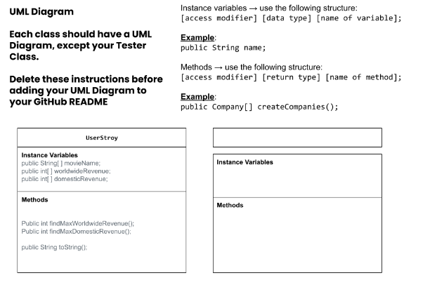

# Unit-3-asphalt-art-project
# Unit 3 - Data for Social Good Project 

## Introduction 

Software engineers develop programs to work with data and provide information to a user. Each user has different needs based on the information they are looking for from data. Your goal is to create a data analysis program for your user that stores and analyzes data to provide the information they need. 

## Requirements 

Use your knowledge of object-oriented programming, one-dimensional (1D) arrays, and algorithms to create your data analysis program: 
- **Write a class** – Write a class to represent your user or business and store and analyze their data with no-argument and parameterized constructors. 
- **Create at least two 1D arrays** – Create at least two 1D arrays to store the data that your user needs information about. 
- **Write a method** – Write a method that finds or manipulates the elements in a 1D array to provide the information your user needs. 
- **Implement a toString() method** – Write a toString() method that returns general information about the data (for example, number of values in the dataset). 
- **Document your code** – Use comments to explain the purpose of the methods and code segments and note any preconditions and postconditions. 

## User Story 

> As a film critic, I want to analyze review data so that I can find the highest grossing films this year.

## Dataset 

Dataset: https://www.boxofficemojo.com/year/world/?ref_=bo_nb_in_tab

Release Group (String) - name of the movie
Worldwide (int) - how much worldwide revenue it produced
Domestic (int) - how much domestic revenue it produced

## UML Diagram 

In this project titled "Data for Social Good" we chose to use a User Story of a film critic who wants to analyze review data in order to find the most grossing film of 2024. Our data set came from the source Box Office Mojo and it provided information that would help answer the Users question. From the data set we decided to use the Release Group, Worldwide, and Domestic columns of information as we saw that it would provide the most useful inputs when it came to finding the what it was that the user had asked. The project adressed the users goals by using the data set and making them into 1D arrays that could be traversed through all the elements to find the maximum value for each array. The maximum values for the worldwide and domestic revenue would lead to finding which of all the movies released in 2024 where the grossed the highest. This was displayed in the project for the user using a toString method in which it used the results after the maximun worldwide and domestic revenue methods had run. It also uses the movie name that corresponds to the information that was given.

